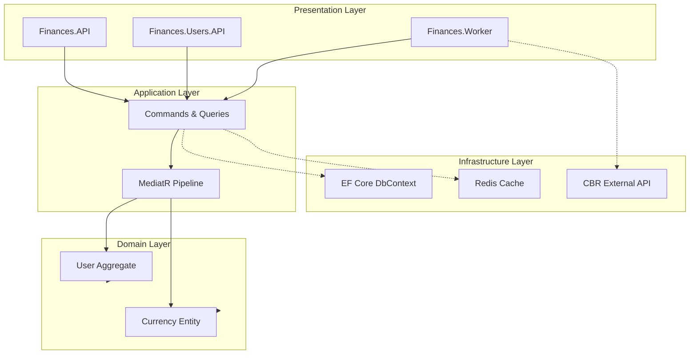

# FinancesApp — Personal Finance Demo Management System


Finances is a production-ready, modular system designed for personal finance tracking and currency management. The application provides a robust infrastructure for synchronizing real-time exchange rates from the Central Bank of Russia (CBR) and managing user-specific currency preferences.

## Technology Stack

| Category | Technology | Description |
| :--- | :--- | :--- |
| **Language** | C# 14 / .NET 10 | Modern cross-platform framework |
| **Architecture** | Modular Monolith | DDD, CQRS, Clean Architecture |
| **Database** | PostgreSQL 17 | Relational Database (Docker) |
| **ORM** | EF Core 10 | Code-First migrations |
| **Caching** | Redis | Distributed Cache & Locking |
| **Jobs** | Quartz.NET | Background currency updates |
| **Observability** | OpenTelemetry, Serilog, Seq | Distributed tracing, metrics, and structured logging |
| **Testing** | xUnit, Testcontainers | Integration & Unit Tests |
| **Containerization** | Docker Compose | Local development environment |

## Architecture Overview



***Getting Started:***

1. Clone the repo:
```
bash
git clone https://github.com/yourusername/finances.git
cd finances
```
2. Ensure Docker Desktop is running.

3. Launch the application:
Run the following command in the root directory (where the docker-compose.yml file is located):
```
bash
docker compose up --build -d
```

Users.API: http://localhost:44398/swagger/index.html

Finances.API: http://localhost:44357/swagger/index.html

**Tasks:**

- [x] Implement Database Migration microservice (or tool).

- [x] Implement a Background Service (Worker) that fetches data from http://www.cbr.ru/scripts/XML_daily.asp and populates the Currency table.

- [x] Implement User Microservice (Identity). Required functionality: User Registration, Login, Logout.

- [x] Implement Finances Microservice. Required functionality: Get currency rates for a specific user (Portfolio).
 Both User and Finances services must be implemented using Clean Architecture and CQRS.

- [x] Implement Authorization using JWT.

- [x] Implement an API Gateway for both microservices.

- [x] Create a project with Unit Tests for User and Finances services (Background service excluded).
- [ ] Implement mail service(MailKit)
